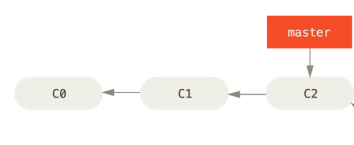
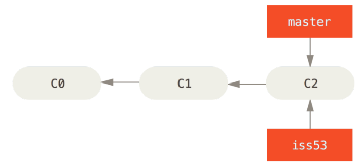
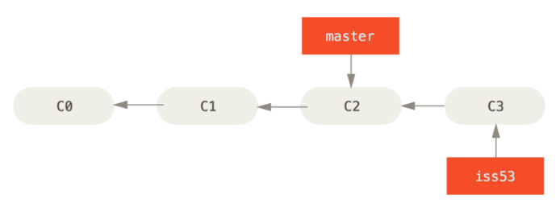
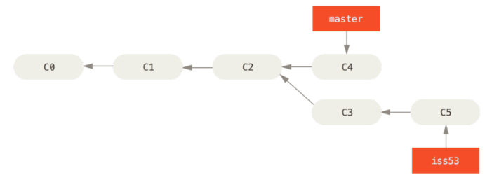

# 
# A brief Git Introduction - XTime
###### Sergio Guillen Mantilla


---
### Antes que nada, funciona en cualquier sistema operativo
OSX
GNU/Linux
Windows con git-bash
Y una gran cantidad de GUI + la integración con IDE

---
# Resources
* Documentación, man pages
* ProGit - Scott Chacon & Ben Straub
* Git con Tom&Jerry - try.github.io
* Git Branching - learngitbranching.js.org

---
# Repository
Un contenedor de código en los que es posible guardar **snapshots** de nuestros archivos.

<center>snapshot = commit</center>
<br />

```
$ git init
```
---
# Tracking changes
Indicar a git los cambios que iran en el **commit**
```
$ git add file1 file2 file3
```
---
# Snapshots
Los snapshots llegan a ser los commits de los cambios que se seleccionar con el comando `git add`. Para realizar el commit ejecutamos:

```
$ git commit -m "Mensaje del commit"
```

---
# Basic Commit Structure
```
$ git log

commit d2e5ea8b2e808763f35a957883af09760b3c7380
Author: Sergio Guillen <serguimant@gmail.com>
Date:   Thu Apr 27 23:31:31 2017 -0400

    First commit
```

---
# Commit Messages
```
Header line: explaining the commit in one line

Body, explaining in more detail what the commit
changes are all about.

Try to fit each line less that 74 characters ;)

```

---
# Commit Messages
```
fix
```
---
# 
---
# Time Travel :watch:
Cada **commit** llega a ser un nodo en nuestro repositorio. `HEAD` apunta por defecto al último commit

La herramienta que nos permite "viajar en el tiempo" es `git-checkout`

```
$ git checkout d2e5ea8b2e808763f35a957883af09760b3c7380
$ git checkout <branch>
```

---
# Branches
Un branch llega a ser un puntero dinámico que apunta al último commit de la rama en la que se este trabajando. El branch por defecto en un repositorio git se llama `master`

---
# Branches
```
$ git checkout -b iss53
$ git branch iss53 && git checkout iss53
```

# 

---
```
(iss53)$ git commit -m "C3"
```
# 

---
# 

---
# Remotes
Un remote es simplemente otro repositorio git que puede ser accedido remotamente:
* GitHub
* GitLab
* Bitbucket
* Gogs
* git init --bare *(servidor propio)*

---
# Remotes
Los comando básicos para trabajar con remotes son:
```
$ git pull <remote> <branch>
$ git push <remote> <branch>
```

---
# GitHub
GitHub cuenta con un feature super importante que son los Pull Requests, que básicamente nos sirve como mecanismo de contribución y tener un mejor control de lo que se acepta en un branch.

```
From branch ENG-1234 to development
From development to Testing
...
```
---
# Others
* Squash
* Stash
* Cherry-pick

<!--
things to do:
-- for any operating system --

let's you tell the story of your project
    snapshots which is a commit
        say structure of commit (hash, message, etc.)
commit messages
time travel or checkout :DD
branches (para hacer atrocidades) lo cual genera mucho flujos de trabajo
three-way-merge

branch pointer to a commit to follow branch
merge a combination of two or more branches 

a remote
clone 
push
pull

other tips
   stash
   squash
github
   pull requests
   
migration from svn
challenges

resources
   progit
   git with tom and jerry
   git branching
->